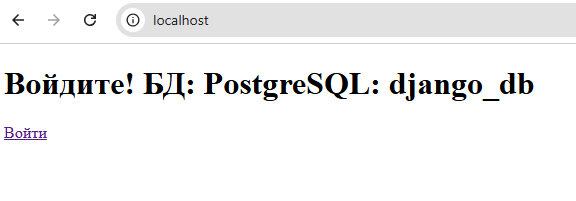
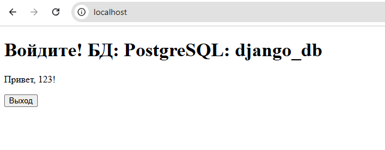

# Django Auth App с Docker compose

Простое Django-приложение с авторизацией (логин/логаут) в Docker-compose. Главная страница показывает статус авторизации. и используемое БД

Миграции проведены, создан файл db.sqlite3 для тестав авторизации

Как запустить проект у себя:
```bash
git clone git@github.com:adresmoke/djangowithcompose.git
sudo docker compsoe up -d
```
Остановить и удалить контейнер:
```bash
sudo docker compsoe down
```
login: 123
passwd: 123


